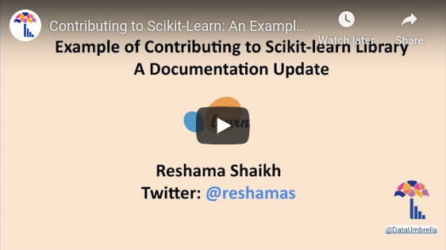

# WiMLDS-Paris-Sprint
Repository with materials and instructions to setup your environment for the WiMLDS Paris' sprint.

_2022, March 12_

## Before the Sprint
- Create your [github account](https://github.com/join?ref_cta=Sign+up&ref_loc=header+logged+out&ref_page=%2F&source=header-home) 
if you don't have one already.
- **Set up your development environment** following the instructions in the markdown file of this repo:
  - [1.environment.md](1.environment.md)
  - [2.building.md](2.building.md)
- **Get familiar with the scikit-learn development process**
  - [3.example.md](3.example.md)
  - [4.test.md](4.test.md)
  - [5.workflow.md](5.workflow.md)
  - [6.ci.md](6.ci.md)
  - [7.documentation.md](7.documentation.md)
- Have a look a the resources linked below.
- Feel free too ask for help on the [Gitter Sprint Channel](https://gitter.im/scikit-learn/sprint), at any time.

## Resources for beginners

#### [Scikit-learn contributor's documentation](https://scikit-learn.org/dev/developers/contributing.html)

#### [Craft Minimal Bug Reports](https://matthewrocklin.com/blog/work/2018/02/28/minimal-bug-reports)

#### Crash course in contributing to open source projects

by [Andreas Mueller](https://github.com/amueller)

#### Example of Submitting a Pull request to scikit-learn

by [Reshama Shaikh](https://github.com/reshamas/)

